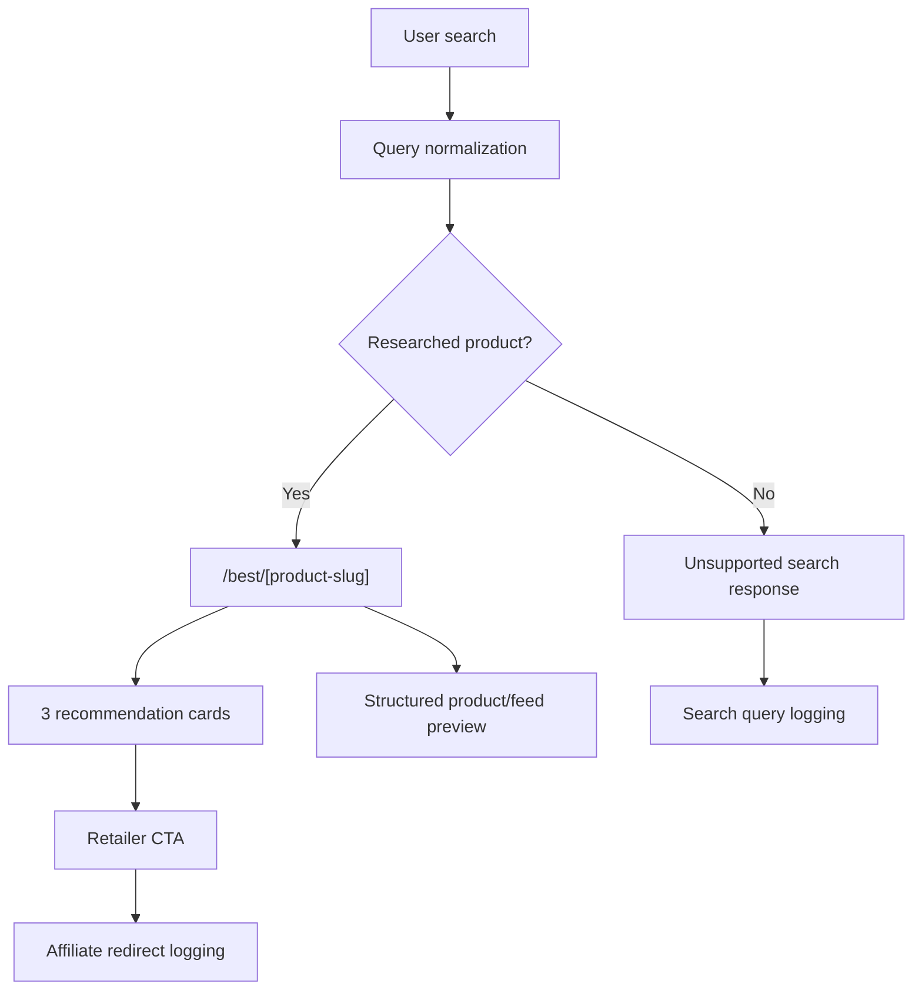
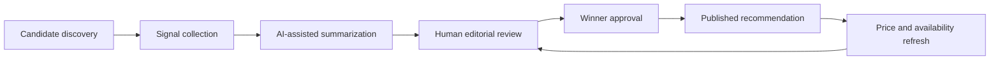

# Architecture

Toppp is designed as a small but production-shaped vertical slice for AI shopping.

The current prototype uses a simple web app, structured product data, affiliate redirects, search logging, and an ACP-inspired product-feed preview.

## High-Level Flow

## Core App Surfaces

- `/` - homepage with search and product shortcuts
- `/best/[slug]` - researched product answer page
- `/search` - unsupported or alias search flow
- `/case-study` - shareable product explanation
- `/api/search` - query matching and unsupported search logging
- `/api/affiliate/redirect` - click logging before outbound retailer redirect
- `/api/acp-preview/products` - demonstration product feed preview
- `/llms.txt` - AI-readable product/site summary

## Data Model

The MVP data model is intentionally commerce-ready:

- `categories` - product pages such as `gaming-desktop`
- `products` - canonical product records
- `retailers` - Amazon, Walmart, Best Buy, Target, brand sites
- `offers` - price, availability, retailer URL, affiliate URL
- `recommendations` - winner bucket, pros, cons, explanation, confidence
- `evidence_sources` - source summaries and retrieval metadata
- `search_queries` - unsupported query capture
- `affiliate_clicks` - outbound click logging

## Why Structured Data Matters

AI shopping experiences need more than page text. They need durable product entities and offer records.

Toppp's internal shape is designed around:

- Stable category IDs
- Stable product IDs
- Offer IDs
- Retailer metadata
- Price and availability fields
- Recommendation bucket metadata
- Evidence summaries
- Affiliate disclosure

That structure makes the product easier to adapt to future commerce feeds, checkout integrations, and assistant surfaces.

## Recommendation Lifecycle

## Technology Choices

The prototype is built with:

- Next.js for the web app
- Vercel for deployment
- Supabase Postgres for structured data
- Tailwind CSS for UI
- Seed data for the first vertical slice

This stack keeps the app deployable and easy to iterate while preserving a path toward real product feeds and editorial tooling.

